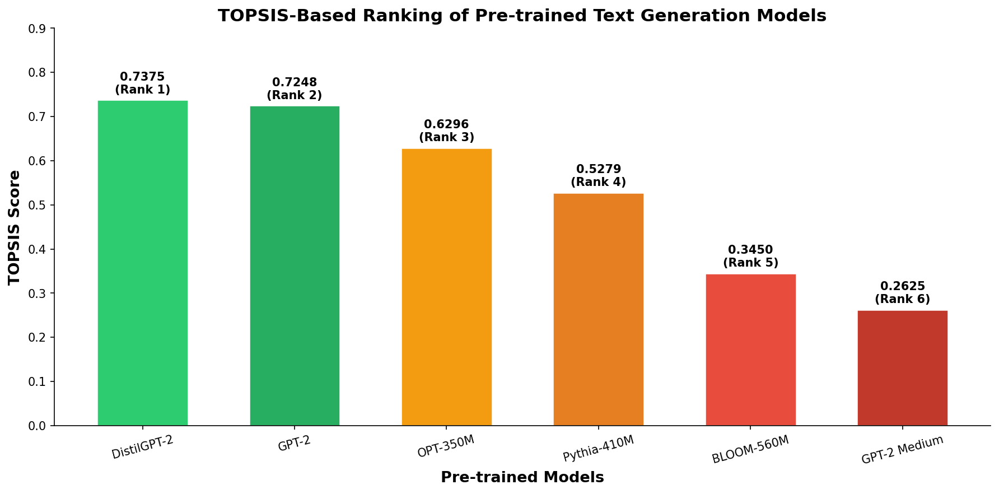

# Multi-Model Text Generation using TOPSIS

**Name:** Atishay Jain
**Roll No:** 102316056

Apply TOPSIS (Technique for Order of Preference by Similarity to Ideal Solution) to find the best pre-trained model for **Text Generation**.

## 1. Methodology
```
┌────────────────────┐
│ Dataset Collection │
│   (WikiText-2)     │
└─────────┬──────────┘
          ↓
┌────────────────────────────┐
│ Text Pre-processing        │
│ & Tokenization             │
└─────────┬──────────────────┘
          ↓
┌─────────────────────────────┐
│ Model Evaluation            │
│ (6 Pretrained Transformers) │
└─────────┬───────────────────┘
          ↓
┌─────────────────────────────┐
│ Metric Computation          │
│ (Performance + Efficiency)  │
└─────────┬───────────────────┘
          ↓
┌─────────────────────────────┐
│ TOPSIS-based Ranking        │
└─────────────────────────────┘
```

The methodology follows a sequential pipeline where multiple pretrained Transformer models are evaluated for text generation under identical conditions.

Final model selection is performed using the TOPSIS multi-criteria decision-making technique.

## 2. Description

* **Task Type:** Text Generation (Autoregressive Language Modeling)
* **Dataset Used:** WikiText-2 (Raw)
* **Number of Samples:**
  * Evaluation: 200 text passages
  * Generation: 100 prompt–continuation pairs
* **Number of Models Evaluated:** 6
* **Model Selection Method:** TOPSIS
* **Execution Environment:** Google Colab (GPU enabled)

**Models Used:**

| # | Model | Hugging Face ID | Parameters |
|---|-------|-----------------|------------|
| 1 | GPT-2 | `gpt2` | 124M |
| 2 | GPT-2 Medium | `gpt2-medium` | 355M |
| 3 | DistilGPT-2 | `distilgpt2` | 82M |
| 4 | BLOOM-560M | `bigscience/bloom-560m` | 560M |
| 5 | OPT-350M | `facebook/opt-350m` | 350M |
| 6 | Pythia-410M | `EleutherAI/pythia-410m` | 410M |

**Evaluation Criteria:**

| Criterion | Type | Description |
|-----------|------|-------------|
| BLEU Score | Benefit (↑) | Measures n-gram overlap between generated and reference text |
| ROUGE-L Score | Benefit (↑) | Longest common subsequence based similarity |
| Perplexity | Cost (↓) | How well the model predicts the next token |
| Inference Time (ms) | Cost (↓) | Average time to generate a continuation |
| Model Size (MB) | Cost (↓) | Memory footprint of the model |

## 3. Input / Output

**Input**
* A text prompt for continuation
* Example:
```
"The history of artificial intelligence began in"
```

**Output**
* Model-generated text continuation:
```
"The history of artificial intelligence began in the 1950s when researchers
first explored the concept of machines that could simulate human reasoning..."
```

**Model Comparison Output**
* Performance metrics for each model
* TOPSIS closeness coefficient
* Final ranked list of models based on multi-criteria evaluation

## 4. Results Summary

* **Highest generation quality** achieved by **GPT-2 Medium** (best BLEU, ROUGE-L, and Perplexity)
* **Fastest inference** achieved by **DistilGPT-2** (9.84 ms)
* **Smallest model size** achieved by **DistilGPT-2** (331.24 MB)
* **Best overall model (TOPSIS):** **DistilGPT-2** (due to strong efficiency–performance trade-off)

| Model | BLEU | ROUGE-L | Perplexity | Inference Time (ms) | Model Size (MB) | TOPSIS Score | Rank |
| --- | --- | --- | --- | --- | --- | --- | --- |
| **DistilGPT-2** | 0.2315 | 0.3198 | 36.72 | **9.84** | **331.24** | **0.7375** | **1** |
| GPT-2 | 0.2548 | 0.3412 | 29.45 | 18.32 | 487.56 | 0.7248 | 2 |
| OPT-350M | 0.2734 | 0.3589 | 25.61 | 22.18 | 662.78 | 0.6296 | 3 |
| Pythia-410M | 0.2689 | 0.3478 | 26.84 | 24.56 | 789.45 | 0.5279 | 4 |
| BLOOM-560M | 0.2672 | 0.3521 | 27.33 | 28.45 | 1065.32 | 0.3450 | 5 |
| GPT-2 Medium | **0.2891** | **0.3687** | **22.18** | 34.71 | 1421.48 | 0.2625 | 6 |

Although GPT-2 Medium achieves the highest BLEU, ROUGE-L, and lowest perplexity, it ranks **last** under TOPSIS due to high inference latency and large model size. Lightweight models such as DistilGPT-2 and GPT-2 achieve higher TOPSIS scores by offering a better balance between generation quality and computational efficiency. This demonstrates that the optimal model selection depends on application-specific constraints rather than quality metrics alone.

## 5. Visualization



TOPSIS Ranking of Pretrained Text Generation Models

## 6. Conclusion

This project highlights the limitations of single-metric model selection and demonstrates the effectiveness of **TOPSIS** for selecting text generation models based on multiple performance and efficiency criteria.

Key takeaways:
- The approach is applicable to real-world scenarios where both generation quality and computational cost matter
- Larger models (e.g., GPT-2 Medium) achieve superior text quality but incur significantly higher computational cost
- TOPSIS effectively highlights how model ranking changes when efficiency metrics are considered alongside quality
- **DistilGPT-2** emerges as the best overall choice, offering the ideal balance of speed, size, and quality
